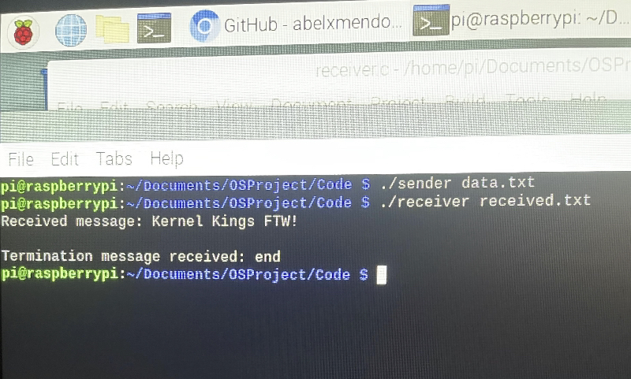

# CPSC351-OperatingSystems-Sender and Receiver

## **Authors: The Kernel Kings**

**Abel Mendoza: abel_mendoza10@csu.fullerton.edu**

**Christian Marshall: christian.marshall.91@gmail.com**

**Fernando Cerna: fernandocerna94@csu.fullerton.edu**

**Gilbert Espino Solis: Soccergilberto@csu.Fullerton.edu**

**Sohrab Bahari:**

---

This repository contains the code for a simple sender and receiver program implemented in C, which demonstrates inter-process communication using shared memory and message queues in an operating system.

## Overview

The sender and receiver programs facilitate the transfer of a file from the sender to the receiver using shared memory and message queues. The sender program reads the contents of a file and transfers them to the receiver via shared memory segments. The receiver program receives the data from the sender and writes it to a file.

## Prerequisites

To run the sender and receiver programs, the following prerequisites should be met:

* Linux operating system (tested on Ubuntu 18.04)
* GCC compiler
* POSIX-compliant environment

## Usage

1. Clone the repository:

```shell
git clone https://github.com/abelxmendoza/CPSC351-SenderAndReceiverOS.git
```

2. Compile the sender program:

```shell
gcc sender.c -o sender
```

3. Compile the receiver program:

```shell
gcc receiver.c -o receiver
```

4. Run the sender program:

```shell
./sender <filename>
```

Replace `<filename>` with the path to the file you want to transfer. For our project we use `data.txt`

5. Run the sender program:

```shell
./sender data.txt
```

6. Run the receiver program:

```shell
./receiver <output_filename>
```

Replace `<output_filename>` with the desired name of the file to save the received data.

7. The receiver program will create the `<output_filename>` file and write the received data into it.

   

## Additional Files

* **signaldemo.cpp** : This file demonstrates how to handle signals in C++. It shows an example of a signal handler that catches and processes a `SIGINT` signal (Ctrl+C).
* **keyfile.txt** : This file is used by the sender and receiver programs to generate a unique key for accessing shared memory and message queues. It is required for proper initialization of the inter-process communication.
* **data.txt** : This is an example file that can be used as input for the sender program. You can replace it with your own file that you want to transfer.
* **msg.h** : This header file defines the message structures used by the sender and receiver programs for inter-process communication. It includes structures such as `struct message` and `struct fileNameMsg` that define the format of messages exchanged between the sender and receiver.
* **msg2.h** : This alternative header file also defines the message structures used by the sender and receiver programs for inter-process communication. It includes structures such as `struct message` and `struct fileNameMsg` with slightly different definitions compared to `msg.h`. Choose either `msg.h` or `msg2.h` based on your requirements.

## Design of Sender and Receiver

See Doc: [https://docs.google.com/document/d/1le0dxFglva1m8F39k4EDe-hh32uZOH5evqC40YH5QPw/edit?usp=sharing](https://docs.google.com/document/d/1le0dxFglva1m8F39k4EDe-hh32uZOH5evqC40YH5QPw/edit?usp=sharing)

## Team Contributions

**Abel Mendoza**: Coordinated with group to get the sender and receiver scripts finished with all the rubric requirements. Wrote documentation for the project, put together a github repository with all the files, and also included a LICENSE and README.

**Christian Marshall**: Collaborated on the sender file and implementing all the to-dos such as allocating and deallocating shared memory

**Fernando Cerna**: Collaborated on the sender file and implementing all the to-dos such as allocating and deallocating shared memory

**Gilbert Espino Solis**: Helped collaborate and implement receiver file for all the to dos.

**Sohrab Bahari**:

[
]()

## Contributing

Contributions to this repository are welcome. If you find any issues or have suggestions for improvements, please create an issue or submit a pull request.

## License

This project is licensed under the [MIT License](https://chat.openai.com/c/LICENSE).

Feel free to update the README.md file according to your specific requirements and additional information about the project.
